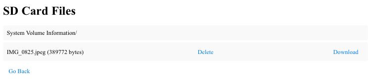

# Personal-Server

This Project Contains All the Information About Building the Secure Personal Server Using NodeMCU ESP8266 and SD Card Module

# 🔗 Project Overview:

This Project is a Complete build over to set-up your own server and share files through wifi.

#  Project Circuit:

SD Card Module -> ESP8266 NodeMCU 1.0

CS -> D8
SCK -> D5
MOSI -> D7
MISO -> D6
VCC -> 3V
GND -> GND

# 🚀 Key Features:

1. **File Upload and Storage**  
   - Users can upload files from their local device to the SD card connected to the ESP8266 NodeMCU through a simple web interface.  
   - Supports various file types and ensures proper handling during upload.  

2. **File Listing with Metadata**  
   - Dynamically lists all files stored on the SD card.  
   - Displays file names, sizes, and identifies directories.

3. **File Management (Delete & Download)**  
   - Each listed file has dedicated "Delete" and "Download" options.  
   - **Delete:** Removes the selected file from the SD card permanently.  
   - **Download:** Downloads the file with the appropriate format and content type for local use.  

4. **Responsive Web Interface**  
   - Clean and intuitive HTML-based web interface with integrated CSS for enhanced user experience.  
   - Buttons for upload, navigation, and file actions are styled for clarity and accessibility.

5. **Content-Type Detection for File Downloads**  
   - Dynamically detects file extensions to set the correct MIME type during downloads (e.g., `text/plain` for `.txt`, `image/jpeg` for `.jpg`).  
   - Ensures seamless file download experience for a variety of file formats.  

6. **Secure Wi-Fi Access Point**  
   - Configures the ESP8266 as a secure Wi-Fi access point with a predefined SSID and password, providing a private network for file management.  

7. **Real-Time File Operations**  
   - Utilizes HTTP methods to perform real-time operations on files such as upload, download, and delete without needing to restart the server.  

8. **SD Card Integration**  
   - Fully leverages the ESP8266's SPI interface for seamless SD card communication.  
   - Handles directories and file operations efficiently.  

9. **Error Handling**  
   - Provides user-friendly error messages for scenarios like failed SD card initialization, file not found, or upload failures.
  

10. **Compact and Portable**  
    - The entire system is compact, portable, and can be deployed with minimal hardware (ESP8266, SD card module, and power supply).  

This project demonstrates the power of ESP8266 for IoT applications, offering a practical solution for local file management via a wireless connection. Let me know if you'd like to enhance or clarify any feature!

# 🔧 Technical Highlights:

1. **ESP8266 Wi-Fi Integration**  
   - Configures the ESP8266 NodeMCU as a Wi-Fi access point, enabling wireless communication.  
   - Hosts a local HTTP server to serve web pages for file management.  

2. **SD Card Communication via SPI**  
   - Utilizes the SPI interface for efficient communication with the SD card module.  
   - Supports standard SD card file operations like read, write, delete, and list.  

3. **Dynamic HTML Rendering**  
   - Generates HTML content dynamically on the server to list files and handle file-specific actions (delete, download).  
   - Includes CSS integration for enhanced user experience.  

4. **File Upload Handling**  
   - Implements multipart file upload handling using the `HTTPUpload` object.  
   - Processes data chunks in real-time to write uploaded files directly to the SD card.  

5. **HTTP Protocol Usage**  
   - Leverages HTTP GET and POST methods for client-server communication.  
   - Routes:
     - `/`: Serves the main interface for uploads and navigation.  
     - `/upload`: Handles file uploads via HTTP POST.  
     - `/list`: Displays files on the SD card.  
     - `/delete`: Deletes a specified file using HTTP GET.  
     - `/download`: Streams files to clients with correct MIME types for downloading.  

6. **MIME Type Detection**  
   - Detects file extensions to assign appropriate MIME types for downloads.  
   - Supports a variety of file types (e.g., `.txt`, `.jpg`, `.html`, `.pdf`, etc.).  

7. **Error Handling Mechanisms**  
   - Verifies SD card initialization and provides error feedback if the card is not detected.  
   - Handles file-related errors like nonexistent files, failed uploads, or write errors.  

8. **Real-Time File Streaming**  
   - Streams files directly from the SD card to the client for efficient downloads, regardless of file size.  
   - Ensures files retain their original format and encoding during downloads.  

9. **Efficient Memory Usage**  
   - Processes files in chunks to avoid memory overflows during upload and download operations.  
   - Closes unused file handles promptly to conserve resources.  

10. **Cross-Platform Accessibility**  
    - The web interface can be accessed from any device with a browser (smartphones, PCs, tablets).  
    - No additional software or drivers required.  

11. **Lightweight and Modular Code Design**  
    - Uses well-organized functions to separate concerns (e.g., upload handling, file listing, and HTTP routing).  
    - Can be extended or modified easily for additional features like file renaming or directory management.  

12. **Secure Local Access**  
    - Protects access to the file manager using a password-protected Wi-Fi network.  
    - Enhances privacy and prevents unauthorized access.  

These technical highlights demonstrate the project's advanced use of embedded systems, networking, and web technologies, offering a practical example of an IoT-enabled file management system.

# 🌟 Project Impact:

1. **Enhanced Accessibility**: Enables wireless file management via a user-friendly web interface, eliminating the need for physical access to the SD card.  

2. **Cost-Effective**: Utilizes affordable components like ESP8266 and SD card modules, making it suitable for budget-conscious IoT projects.  

3. **Educational Value**: Demonstrates key IoT concepts such as HTTP server setup, file handling, and Wi-Fi integration, ideal for students and hobbyists.  

4. **Improved Workflow**: Streamlines data management, saving time and effort in applications requiring frequent file updates or retrievals.  

5. **Scalable Solution**: Lays the foundation for advanced features like cloud integration or encrypted file transfer for more sophisticated IoT applications.

# 🔍 Looking Ahead

1. **Cloud Integration**: Extend the project by connecting it to cloud storage platforms like Google Drive or AWS for seamless file synchronization.  

2. **Enhanced Security**: Incorporate features like file encryption and secure access via HTTPS to ensure data safety.  

3. **Expanded File Support**: Add support for larger SD cards and additional file formats for versatile applications.  

4. **Automation**: Implement scheduled file transfers or backups to improve efficiency in data management.  

5. **IoT Ecosystem**: Integrate with other IoT devices for advanced use cases like real-time data logging or remote monitoring.

# 💬 Connect with Me:

I am always open to feedback, collaboration opportunities, and discussions about game development. Feel free to connect with me if you're interested in learning more about this project or if you have any insights to share!

# [LinkedIn/Madhesh H](https://www.linkedin.com/in/madheshh/)
# [LinkedIn/Agilesh Arumugam](https://www.linkedin.com/in/agilesh-arumugam/)
